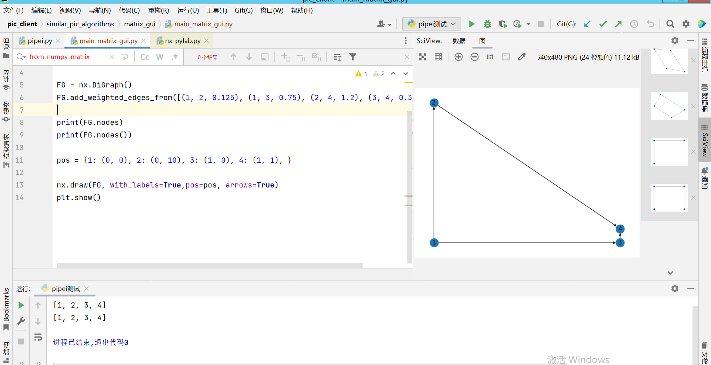
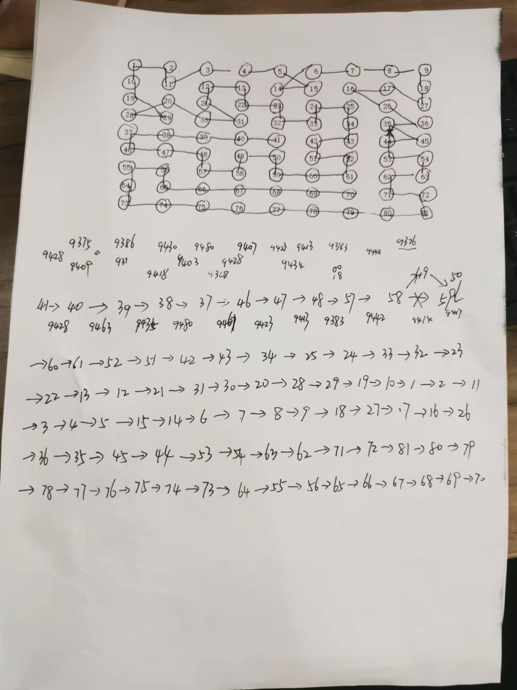
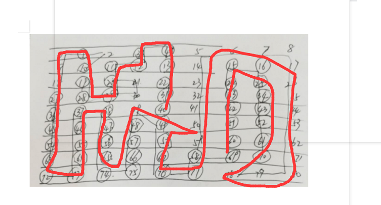

# 王琳-相似图片最佳路径寻找问题

## 图形化矩阵有向连线

## 算法优化使得其接近于一个贪吃蛇路径图像

# 维护

### ToDo

- [ ] 有向图自动化生成的程序
- [ ] 优化算法，解决自行车图片路径容易竖着连接但是不容易横着连接的问题
- [ ] 整体方差最小算法设计
- [ ] 了解图像近似程度处理办法：均值哈希算法、差值哈希算法、感知哈希算法、灰度直方图算法、RGB每个通道的直方图相似度等

### 2022-7-14

看了[networkx官方文档](https://networkx.org/documentation/latest/tutorial.html)和[CSDN:设置networkx中每个节点的位置](https://blog.csdn.net/qq_39187959/article/details/111290008)之后，有了思路，计划晚上写一下有向图自动化生成的程序。

简单完成了一个小demo，如图所示：

### 2022-7-13

1. 新增需求：新增图形化界面，避免人工工作

矩阵路径连线

2. 优化算法，解决自行车图片路径容易竖着连接但是不容易横着连接的问题

这里的图片容易竖着连接但是不容易横着连接，可能摄像机在拍摄过程中，横着移动没有竖着移动拍摄的图片连贯

